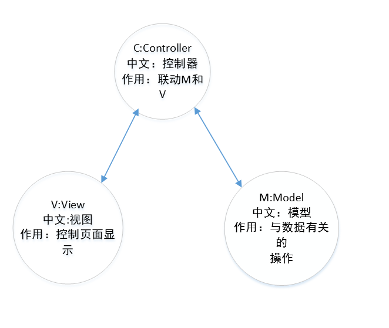
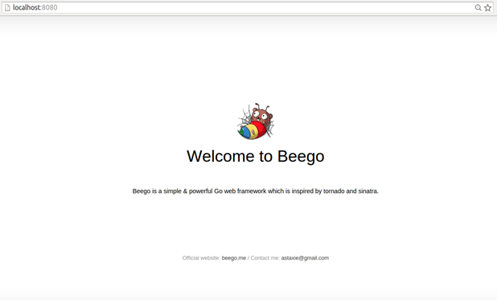
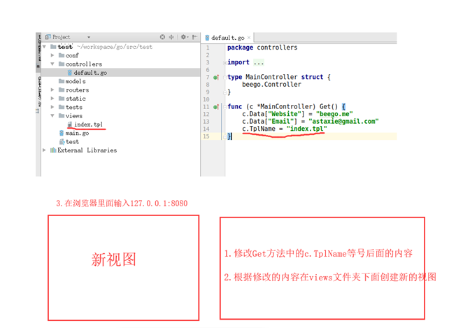

# beego框架

## 1.Beego框架了解

## 2.beego框架快速入门

### 1.1beego框架了解


​                                                                      **Beego作者：谢孟军**

Beego框架是go语言开发的web框架。

**那什么是框架呢？**就是别人写好的代码，我们可以直接使用！这个代码是专门针对某一个开发方向定制的，例如：我们要做一个网站，利用 beego 框架就能非常快的完成网站的开发，如果没有框架，每一个细节都需要我们处理，开发速度会大大降低。 

go语言的web框架：beego,gin,echo等等，那为什么我们选择beego呢？

第一，beego是中国人开发的，开发文档比较详细，**beego官网网址:** <https://beego.me/> 。第二，现在公司里面用beego的也比较多，比如今日头条，百度云盘，腾讯，阿里等。

### 2.1MVC架构

Beego是MVC架构。MVC 是一种应用非常广泛的体系架构，**几乎所有的编程语言都会使用到**，而且**所有的程序员在工作中都会遇到**！用 MVC 的方式开发程序，可以让程序的结构更加合理和清晰。 我们画图说明



**beego具体是如何内嵌MVC呢？我们搭起环境通过代码分析。**

### 2.2环境搭建

这里默认大家已经搭建好了go语言的开发环境。

- 需要安装Beego源码和Bee开发工具//sudo apt-get install

  ```shell
  $ go get -u -v github.com/astaxie/beego
  $ go get -u -v github.com/beego/bee
  ```

  beego源码大家都了解，就是框架的源码。

  Bee开发工具带有很多Bee命令。比如`bee new`创建项目，`bee run`运行项目等。

  用bee运行项目，项目自带**热更新**：是现在后台程序常用的一种技术，即在服务器运行期间，可以不停服替换静态资源。替换go文件时会自动重新编译。

  安装完之后，bee可执行文件默认存放在$GOPATH/bin里面，所以需要把$GOPATH/bin添加到环境变量中才可以进行下一步 

  ```shell
  $ cd ~
  $ vim .bashrc
  //在最后一行插入
  export PATH="$GOPATH/bin:$PATH"
  //然后保存退出
  $ source .bashrc
  ```

  安装好之后，运行`bee new preojectName`来创建一个项目，注意：**通过bee创建的项目代码都是在`$GOPATH/src`目录下面的**

  生成的项目目录结构如下:

  ```shell
  quickstart
  |-- conf
  |   `-- app.conf
  |-- controllers
  |   `-- default.go
  |-- main.go
  |-- models
  |-- routers
  |   `-- router.go
  |-- static
  |   |-- css
  |   |-- img
  |   `-- js
  |-- tests
  |   `-- default_test.go
  |-- views
      `-- index.tpl
  
  ```

  **进入项目目录 **执行`bee run`命令，在浏览器输入网址：127.0.0.1：8080，显示如下： 

  



### 2.3beego的项目结构分析

```shell
quickstart
|-- conf
|   `-- app.conf
|-- controllers
|   `-- default.go
|-- main.go
|-- models
|-- routers
|   `-- router.go
|-- static
|   |-- css
|   |-- img
|   `-- js
|-- tests
|   `-- default_test.go
|-- views
    `-- index.tpl
```

**conf文件夹**:放的是项目有关的配置文件

**controllers**:存放主要的业务代码

**main.go**:项目的入口文件

**models**:存放的是数据库有关内容

**routers**:存放路由文件，**路由作用是根据不同的请求指定不同的控制器**

**static**：存放静态资源，包括图片，html页面，css样式，js文件等

**tests**:测试文件

**views：**存放视图有关内容

后面我们重点需要操作的是MVC文件夹，routers文件夹。

### 2.4Beego快速体验



前面我们简单了解了 beego初始化的内容，那么就来个beego的快速体验吧！

根据上图所示的步骤，对自己创建的项目进行三步修改，然后在浏览器是否能看到修改之后的效果。

如果把你们前面做的静态网页放到views文件夹下呢？一个静态网站是不是就出现啦！有没有感受到beego开发网站的快捷！

**代码分析**

```
c.Data["Email"] = "astaxie@gmail.com"是给视图传递数据，在视图界面里面需要用{{ }}加上 . 才能获取到，比如这行代码的意思就是，给视图传递，Key为Email，value为astaxie@gmail.com 的数据。在视图中要通过{{.Email}}就能获取到value值。

c.TplName = "index.tpl"的作用是指定视图。这里面需要注意的是，默认指定的界面是tpl结尾，但是打开这个文件分析，发现还是一个html界面。所以我们也可以用html文件当视图文件。
```


通过我们对Beego的快速体验能够得出如下结论：

**控制器(Controller)的作用**

1.能够给视图传递数据

2.能够指定视图

**视图(View)的作用 **

1.view本质就是个html。所以能在浏览器显示

2.能够接收控制器传递过来的数据