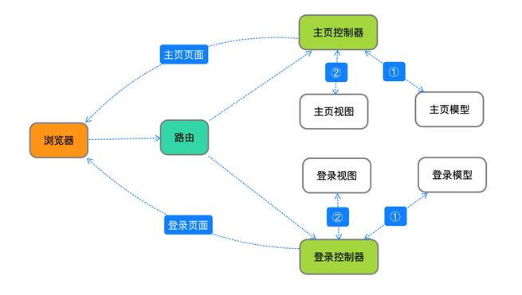

## 2.5Beego运行流程分析



- 浏览器发出请求

- 路由拿到请求，并给相应的请求指定相应的控制器

- 找到指定的控制器之后，控制器看是否需要查询数据库

- 如果需要查询数据库就找model取数据

- 如果不需要数据库，直接找view要视图

- 控制器拿到视图页面之后，把页面返回给浏览器

  **根据文字流程分析代码流程**

- 从项目的入口main.go开始

- 找到router.go文件的Init函数

- 找到路由指定的控制器文件default.go的Get方法

- 然后找到指定视图的语法，整个项目就串起来啦。

### 2.6Post案例实现

刚才我们分析了beego项目的整个运行流程，最终是如何调到Get方法的呢？**beego通过内部语法给不同的http请求指定了不同的方法**，因为我们是从浏览器地址栏发送的请求，属于get请求，所以调用的是Get方法。为了检验老师说的对不对，我们可以实现一个post请求，看看效果。

#### 2.6.1前端修改

**前端代码如下:**

修改我们刚才创建的新的视图，为了能够发送post请求，我们在视图中添加一个能发送post请求的控件`form`

```go
<form method="post" action="/index">
    <input type="submit">
</form>
```

然后设置一个能接收后台传递过来的数据的标签

```go
<h1>hello {{.data}}</h1>
```

全部代码：

```html
<!DOCTYPE html>
<html lang="en">
<head>
    <meta charset="UTF-8">
    <title>Title</title>
</head>
<body>

<form method="post" action="/index">
    <input type="submit">
</form>
<h1>hello {{.data}}</h1>

</body>
</html>
```

#### 2.6.2后台代码修改

**后台代码**

先设置我们Get请求要传递的数据和要显示的视图页面

```go
func (c *MainController) Get() {
	c.Data["data"] = "world"
	c.TplName = "test.html"  //渲染
}
```

再设置我们post请求要传递的数据和要显示的视图页面

```go
func (c *MainController) Post() {
	c.Data["data"] = "我是最棒的"
	c.TplName = "test.html"  //渲染
}
```

**操作**

先在浏览器输入网址，然后点击页面上的按钮，看一下页面的变化，有没有出现`我是最棒的`几个字

### 2.7Beego中路由的快速体验

#### 2.7.1路由的简单设置

路由的作用：**根据不同的请求指定不同的控制器**

```
路由函数：beego.Router("/path",&controller.MainController{})
```

**函数参数：**

先分析一下Url地址由哪几部分组成？ 同一资源定位符

http://192.168.110.71:8080/index

**http://地址:端口/资源路径 **

第一个参数：资源路径，也就是/后面的内容

第二个参数：需要指定的控制器指针

了解上面的内容之后我们来看几个简单的例子：

```go
beego.Router("/", &controllers.MainController{})
beego.Router("/index", &controllers.IndexController{})
beego.Router("/login", &controllers.LoginController{})
```

#### 2.7.2高级路由设置

一般在开发过程中，我们基本不使用beego提供的默认请求访问方法，都是自定义相应的方法。那我们来看一下如何来自定义请求方法。

自定义请求方法需要用到Router的第三个参数。这个参数是用来给不同的请求指定不同的方法。具体有如下几种情况。

- 一个请求访问一个方法(**也是最常用的**)，请求和方法之间用 `:` 隔开，不同的请求用 `;` 隔开:

  ```go
  beego.Router("/simple",&SimpleController{},"get:GetFunc;post:PostFunc")
  ```

- 可以多个请求，访问一个方法 ，请求之间用`,`隔开，请求与方法之间用`:`隔开：

  ```go
  beego.Router("/api",&RestController{},"get,post:ApiFunc")
  ```

- 所有的请求访问同一个方法，用`*`号代表所有的请求，和方法之间用`:`隔开：

  ```go
  beego.Router("/api/list",&RestController{},"*:ListFood")
  ```

- 如果同时存在 * 和对应的 HTTP请求，那么优先执行 HTTP请求所对应的方法，例如同时注册了如下所示的路由：

  ```go
  beego.Router("/simple",&SimpleController{},"*:AllFunc;post:PostFunc")
  ```

  **那么当遇到Post请求的时候，执行PostFunc而不是AllFunc。**

  **如果用了自定义方法之后，默认请求将不能访问。**

