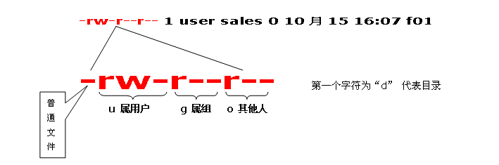

chmod命令用于改变linux系统文件或目录的访问权限。用它控制文件或目录的访问权限。该命令有两种用法。一种是包含字母和操作符表达式的文字设定法；另一种是包含数字的数字设定法。

权限范围的表示法如下：

`u` User，即文件或目录的拥有者；
`g` Group，即文件或目录的所属群组；
`o` Other，除了文件或目录拥有者或所属群组之外，其他用户皆属于这个范围；
`a` All，即全部的用户，包含拥有者，所属群组以及其他用户；
`r` 读取权限，数字代号为“4”;
`w` 写入权限，数字代号为“2”；
`x` 执行或切换权限，数字代号为“1”；
`-` 不具任何权限，数字代号为“0”；
`s` 特殊功能说明：变更文件或目录的权限。

## 语法

`chmod(选项)(参数)`

## 选项

```
-c或——changes：效果类似“-v”参数，但仅回报更改的部分；
-f或--quiet或——silent：不显示错误信息；
-R或——recursive：递归处理，将指令目录下的所有文件及子目录一并处理；
-v或——verbose：显示指令执行过程；
```

## 参数

权限模式：指定文件的权限模式；
文件：要改变权限的文件。

## 知识扩展和实例

Linux用 户分为：拥有者、组群(Group)、其他（other），Linux系统中，预设的情況下，系统中所有的帐号与一般身份使用者，以及root的相关信 息， 都是记录在`/etc/passwd`文件中。每个人的密码则是记录在`/etc/shadow`文件下。 此外，所有的组群名称记录在`/etc/group`內！

linux文件的用户权限的分析图



例：rwx　rw-　r–

r=读取属性　　//值＝4
w=写入属性　　//值＝2
x=执行属性　　//值＝1

```
chmod u+x,g+w f01　　//为文件f01设置自己可以执行，组员可以写入的权限
chmod u=rwx,g=rw,o=r f01
chmod 764 f01
chmod a+x f01　　//对文件f01的u,g,o都设置可执行属性
```

文件的属主和属组属性设置

```
chown user:market f01　　//把文件f01给uesr，添加到market组
ll -d f1  查看目录f1的属性
```

参考链接：

<http://man.linuxde.net/chmod>

<http://www.cnblogs.com/peida/archive/2012/11/29/2794010.html>