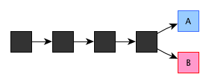
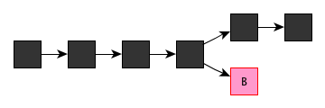
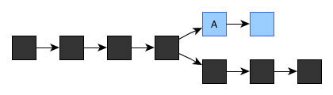

## 区块链中的“双花”问题

我们举个简单的例子，比如你在商场刷卡买东西。这个行为面临三种危险：

1. 首先，刷卡这个行为，验证的是你的信用卡信息，也就是说只要给刷卡机提供同样的信息，就能从你的账户里把钱刷走。没错，很多朋友都听说过，有犯罪组织专门从事复制卡信息的勾当，然后“盗刷”你的卡。在一些不发达国家的小店里刷卡就特别容易中招。

2. 其次，负责记账和结算的卡组织和银行的服务器可能被黑客攻破，造成数据泄露和伪造交易。回想这些年一波又一波某某大公司数据库被黑客攻入的新闻，这危险并非危言耸听。（好吧，认真的geek会说这里用词应该是cracker骇客而非hacker黑客，不过这年头认真的人越来越少了）

3. 最后，还有一种可能，就是用卡人自己可能利用系统网络延迟，在进行第一笔交易、用完所有额度后，趁系统还没记账把额度扣完，立刻进行第二笔交易，形成诈骗。当然目前的结算系统延迟极小，这情况不太可能，不过像在优惠券或者抢购资格这种另外搭建的相对脆弱的系统上还是有可能的。

网上支付也一样，犯罪分子可以用特殊手段（例如木马，伪造WIFI等）截获你跟服务器之间的传递数据，如果商家加密技术太弱的话信息就可能被破解——嗯，某国很多时候数据干脆是不加密的。所以大家才一直被警告不要乱装程序、不要连可疑的WiFi。

区块链是怎么处理这些问题的呢？我们以比特币交易为例，逐条分析。

1. 首先，比特币拥有者想要完成某项交易，比如买手机吧，他会向全网广播：我小A向小B支付1个比特币（嗯，这金额现在大致可以买个5个iPhone 8）。

与这条信息一起的，还有一条加密信息，这条信息是用Hash函数对上一条信息加密生成一个摘要后，再用A的私钥进行加密的（称为私钥“签名”）。

接收到这条信息的B和其他用户先用同样的Hash函数对明文信息生成摘要，再用A的公钥对加密信息进行解密，如果解密得到的摘要与明文生成的摘要相同，便认为信息确实是A发出的，且没有经过篡改。

A的公钥和Hash是公开的，私钥则无法算出，只有A知道，这样就既保证了交易的达成，又保证了A的信息无法被窃取。

2. 其次，由在POW（运算力证明）中胜出的矿工负责这段时间的记账，事先完全无法知道究竟哪个矿工来记账，黑客也就无从黑起，除非碰运气。

3. 最后，在传统系统中因为结算速度极快而不太可能的情况，在比特币网络中反而可能性比较大。因为没有中心化的管理者，交易确认的时间要长很多，使得这种诈骗有可能实现，这就是比特币的double spending双重花费问题，简称“双花”。

对于双花问题，比特币网络，或者说区块链网络，是这么应对的：

-每笔交易都需要先确认对应比特币之前的状态，如果它之前已经被标记为花掉，那么新的交易会被拒绝。

-如果先发起一笔交易，在它被确认前，也就是这个时间段的交易还未被记账成区块block时，进行矛盾的第二笔交易，那么在记账时，这些交易会被拒绝。

-上面只是小伎俩，现在tricky的部分开始了。如果诈骗者刻意把第一笔交易向一半网络进行广播，把第二笔交易向另一半网络广播——这个诈骗者智商还挺高——然后两边正好有两个矿工几乎同时取得记账权，把各自记的block发布给大家的话（这个概率很低），网络是不是会混乱呢，区块链的规则是这样的：先选择任意一个账本都可以，这时候原来统一的账本出现了分叉：

但是在两个账本中各只有一笔交易，诈骗者不会有好处。接下来，下一个矿工选择在A基础上继续记账的话，A分支就会比B分支更长，根据区块链的规则，最长的分支会被认可，短的分支会被放弃，账本还是会回归为一个，交易也只有一笔有效：

-那么如果这个诈骗犯真的智商非常高，他会这么做：如果是A分支被认可（B也一样），相应交易确认，拿到商品之后，立刻自己变身矿工，争取到连续两次记账权，然后在B分支上连加两个block，就像这样：

于是B分支成为认可的分支，A被舍弃，A分支中的交易不再成立，但他已经拿到商品，诈骗成功。

在B分支落后的情况下要强行让它超过A分支，其实是挺难的，假设诈骗者掌握了全网1%的计算能力，那么他争取到记账权的概率就是1%，两次就是10的负4次方。但这个概率还没有太低。

应对办法呢？建议大家在一笔交易确认后，也就是一个block被记下来之后，再等5个block，也就是等6个block被确认后再把交易对应的商品交付。这样，诈骗者还能追上的概率就几乎为0了。除非……

如果诈骗者掌握了全网50%以上的计算力，那么，即使落后很多，他追上也只是时间问题，这就是比特币的“51%攻击”。

这就是区块链需要警惕的问题。虽然在比特币网络中，用户已经极多，全网算力总和非常大，如果真掌握50%以上，也不用靠这个诈骗了，挖矿的收益都更高。但是在小的区块链网络中呢？况且，没有50%以上的算力，还是有机会成功的，只是概率低而已。