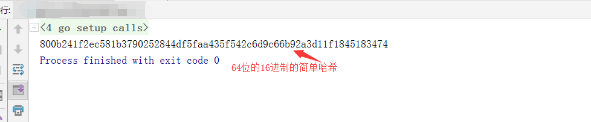

#### 简单区块实现

区块链技术如今已经越来越成熟，但是我们怎么深入到本质用技术的眼光来看待区块链技术，见名知意，区块链的意思就是用链条把区块链接起来，那我们先用代码来看一下，今天我们用go语言来简单的实现一个区块并打印。

> 我们可以先来理一下思路，我们想要实现一个区块该怎么办，思路理好然后再来代码一步一步实现

- 创建一个结构体来保存一个区块的信息  //大概包括时间戳，数据，前哈希，本哈希这几个数据
- 创建第一个区块并给其中的数据赋值，也就相当于一个创世块，注意这里创世块的前哈希传一个空值就可以
- 给这个区块的数据处理一下然后加密得到本区块的哈希
- 主函数里面打印看一下本区块的哈希  //哈希用16进制打印

大概这样思路就可以理顺了，然后我们就可以一步一步实现了

**1：第一步创建一个区块结构体**

```go
type Block struct {
	//创建一个区块结构体
	Timer    int64  //时间戳
	Data     []byte //数据
	prevHash []byte //前一个区块的哈希值
	Hash     []byte //本区块的哈希值
}
```

区块结构体创建完成，继续下一步

**2：创建第一个区块**

```go
func Firstblosk() *Block { //创建第一个区块信息，相当于一个创始块
	firstblock := NewBlock("This is firstblock", []byte{}) //传入参数，返回结构体指针类型
	return firstblock                                      //返回的是结构体指针类型
}
```

```go
func NewBlock(data string, prevhash []byte) *Block { //创建区块的函数
	block1 := Block{}                //创建一个区块结构体
	block1.Timer = time.Now().Unix() //得到时间
	block1.Data = []byte(data)       //传入数据参数
	block1.prevHash = prevhash       //前一个哈希值为传入的数据
	block1.setHash()                 //setHash 方法加密得到自己的hash
	return &block1                   //返回区块指针

}
```

用来创建第一个区块

**3：给区块信息数据处理**

```go
func (block *Block) setHash() {
	time := []byte(strconv.FormatInt(block.Timer, 10))                         //将区块的时间转为字符切片类型，方便加密
	heards := bytes.Join([][]byte{time, block.Data, block.prevHash}, []byte{}) //将时间，数据，前一个哈希拼接一下
	hash := sha256.Sum256(heards)                                              //用sha256包的Sum256函数加密
	block.Hash = hash[:]                                                       //加密后的直接赋值给本哈希
}
```

**4:主函数里面打印看一下本区块的哈希  //哈希用16进制打印**

```go
func main() {
	firstblock := Firstblosk()
	fmt.Printf("%x",string(firstblock.Hash)) //16进制打印

}
```

这样一个简单的区块就创建成功了，我们把所有代码连接起来然后来看一下打印结果

```go
package main

/*一个简单的区块创建实现*/
import (
	"time"
	"strconv"
	"bytes"
	"crypto/sha256"
	"fmt"
)

type Block struct {
	//创建一个区块结构体
	Timer    int64  //时间戳
	Data     []byte //数据
	prevHash []byte //前一个区块的哈希值
	Hash     []byte //本区块的哈希值
}

func (block *Block) setHash() {
	time := []byte(strconv.FormatInt(block.Timer, 10))                         //将区块的时间转为字符切片类型，方便加密
	heards := bytes.Join([][]byte{time, block.Data, block.prevHash}, []byte{}) //将时间，数据，前一个哈希拼接一下
	hash := sha256.Sum256(heards)                                              //用sha256包的Sum256函数加密
	block.Hash = hash[:]                                                       //加密后的直接赋值给本哈希
}
func Firstblosk() *Block { //创建第一个区块信息，相当于一个创始块
	firstblock := NewBlock("This is firstblock", []byte{}) //传入参数，返回结构体指针类型
	return firstblock                                      //返回的是结构体指针类型
}
func NewBlock(data string, prevhash []byte) *Block { //创建区块的函数
	block1 := Block{}                //创建一个区块结构体
	block1.Timer = time.Now().Unix() //得到时间
	block1.Data = []byte(data)       //传入数据参数
	block1.prevHash = prevhash       //前一个哈希值为传入的数据
	block1.setHash()                 //setHash 方法加密得到自己的hash
	return &block1                   //返回区块指针

}
func main() {
	firstblock := Firstblosk()
	fmt.Printf("%x",string(firstblock.Hash)) //16进制打印
}
```

我们来看一下哈希打印结果




这样一个简单的区块就实现了，那么如果要实现一个简单的区块链呢？其实也按照这样的思路写下去也很容易实现，记住：区块链的本区块的哈希是下一个区块的前哈希，这样链接，下一章我们将讲解一个简单的区块链实现。